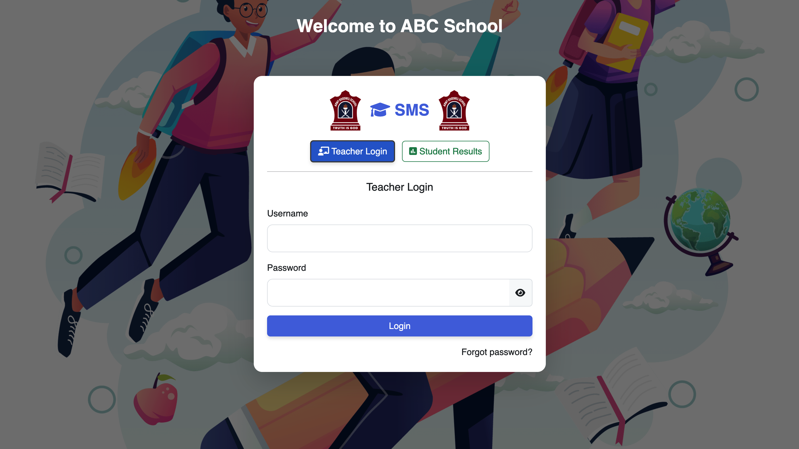
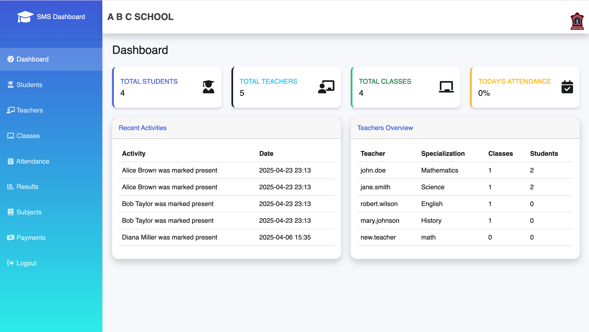

# 🎓 School Management System (SMS)

Welcome to the **School Management System (SMS)** — a web-based platform designed to streamline and digitize school operations including student management, teacher management, class tracking, attendance, results management, and more.

## 📸 Screenshots

### 🔐 Login Page  


### 📊 Dashboard  


---

## 📌 Features

- 📝 **Teacher Login System**
- 👩‍🏫 **Teacher Management**
- 👨‍🎓 **Student Management**
- 📚 **Class Management**
- 🗓️ **Attendance Tracking**
- 📑 **Results Management**
- 📖 **Subjects Management**
- 💵 **Payment Management**
- 🔒 **Secure Password Recovery (with OTP)**

---

## 📂 Project Structure

```plaintext
/ ── index.php              # Login Page
    /dashboard/            # Admin & Teacher Dashboard
        dashboard.php
        students.php
        teachers.php
        classes.php
        attendance.php
        results.php
        subjects.php
        payments.php
    /assets/                # CSS, JS, Images
    /includes/              # Database connection and core logic
    /forgotpassword.php     # OTP-based password recovery
